# Database Integration in IntelliJ

## Informationen

- **Name:** Teodor Stanculeasa
- **Fach:** ITL_1/2
- **Auftrag:** 8. Aufgabenstellung - DB Anbindung in JAVA
- **Datum:** 26.03.2025

## Einleitung

In diesem Projekt habe ich eine MySQL-Datenbank mit IntelliJ verbunden und eine einfache Abfrage auf die Tabelle `EMP` durchgeführt.
Hier dokumentiere ich die Schritte, die ich durchgeführt habe, um die Datenbank einzurichten, mit IntelliJ zu verbinden und eine SQL-Abfrage auszuführen.

## Lernziele

- Einrichtung eines MariaDB/MySQL-Servers auf dem Rechner oder Raspberry Pi
- Verbindung der Datenbank mit IntelliJ
- Erstellung einer einfachen Datenbankanwendung
- Sequenzielles Auslesen aller Datensätze einer Tabelle

## Einrichtung der Datenbank

### 1. Starten von XAMPP
Ich habe XAMPP gestartet, um einen lokalen MySQL-Server zu haben.
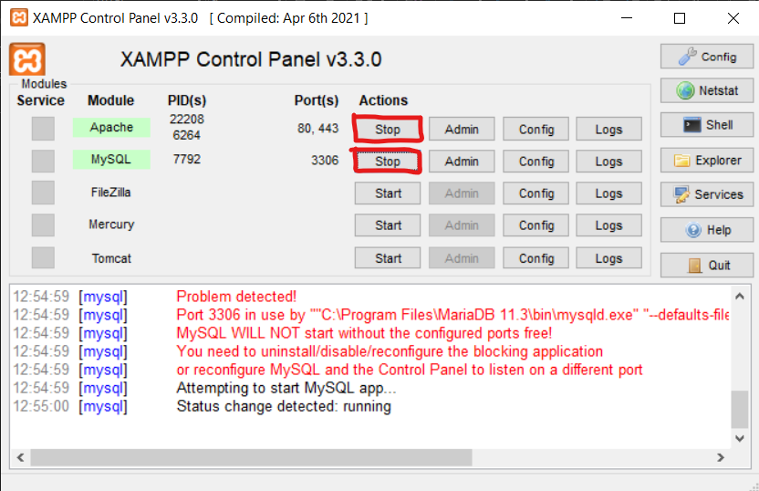

### 2. Erstellen einer neuen Datenbank
Über das Terminal habe ich eine neue Datenbank `company_db` erstellt:
```sql
CREATE DATABASE company_db;
```
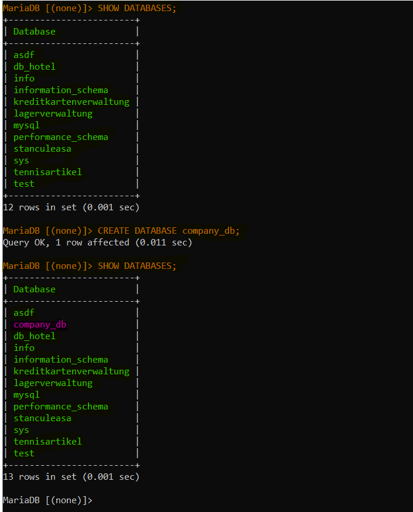

### 3. SQL-Datei ausführen (Tabellen erstellen)
Um die Tabellenstruktur schnell zu erstellen, habe ich die `setup.sql` Datei verwendet:
```sql
SOURCE setup.sql;
```
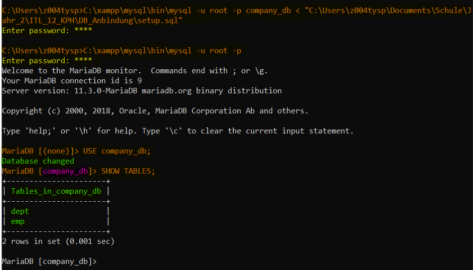

### 4. Überprüfung der Tabellen
Mit einer einfachen SQL-Abfrage habe ich überprüft, ob die `EMP`-Tabelle korrekt erstellt wurde:
```sql
SELECT * FROM EMP;
```
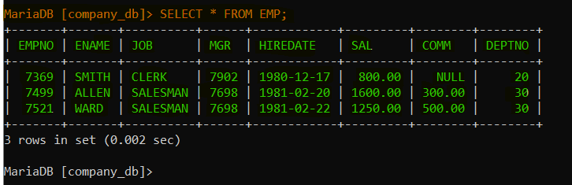

## Verbindung mit IntelliJ

### 1. IntelliJ Plugins prüfen
Ich habe überprüft, ob das `Database Tools and SQL` Plugin installiert ist.
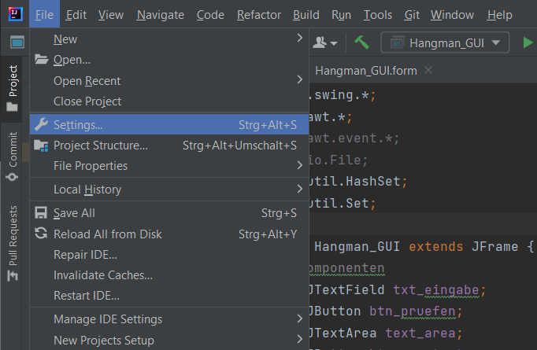

### 2. Installation von DatabaseHelper
Das Plugin `DatabaseHelper` wurde zur einfacheren Verwaltung installiert.
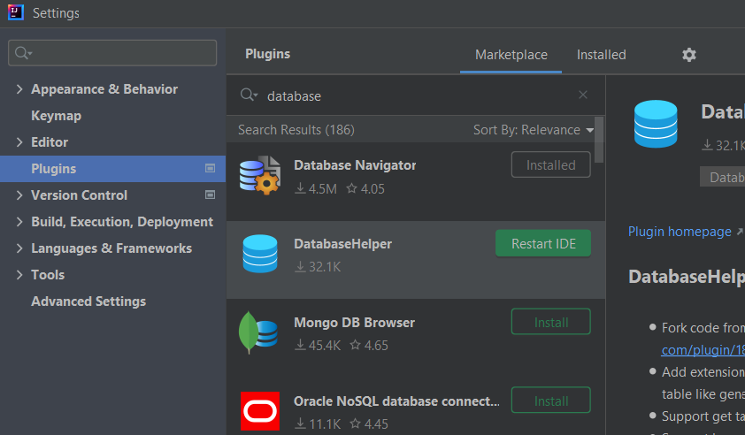

### 3. Verbindung zur Datenbank
Ich habe eine neue Verbindung zur Datenbank eingerichtet und getestet.
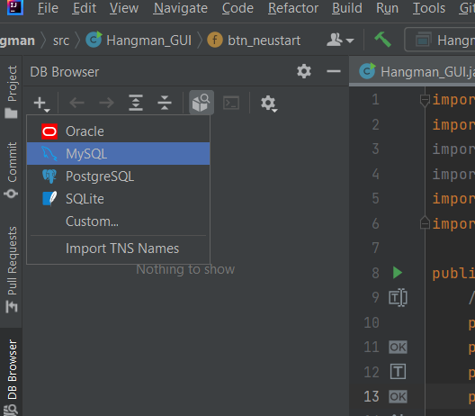
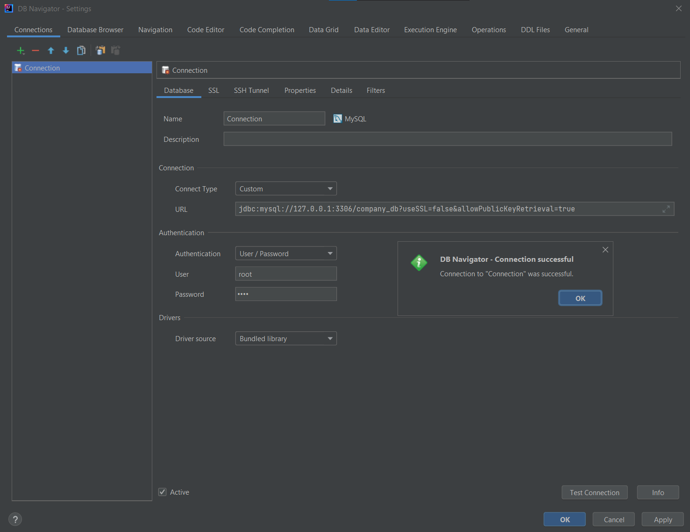

### 4. Datenbank in IntelliJ
Die Datenbank wurde erfolgreich in IntelliJ angezeigt.
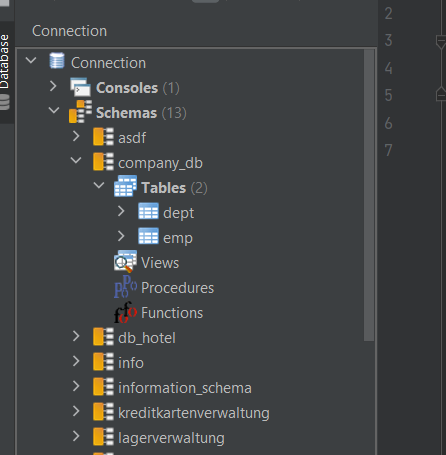

## JDBC-Treiber hinzufügen

### 1. Java Connector herunterladen und einbinden
Ich habe den Java-Connector heruntergeladen und als JAR-Datei hinzugefügt.

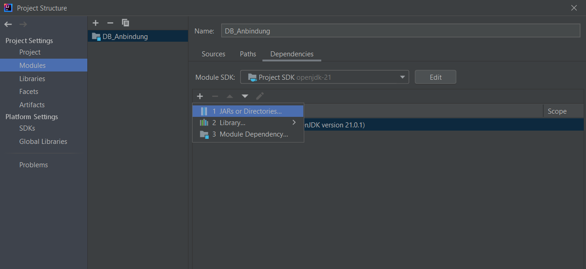

### 2. Konfiguration der Laufzeitumgebung
Damit IntelliJ den JDBC-Treiber findet, habe ich `Use classpath of module` in den Run/Debug-Konfigurationen hinzugefügt.

## Codeausgabe

Nach dem erfolgreichen Ausführen meines Java-Codes wurde folgendes ausgegeben:
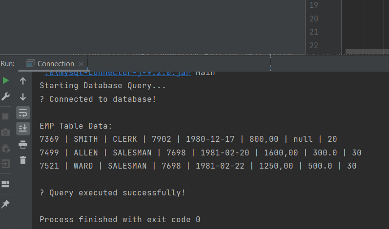

Damit ist die Datenbank erfolgreich in IntelliJ integriert und einsatzbereit.